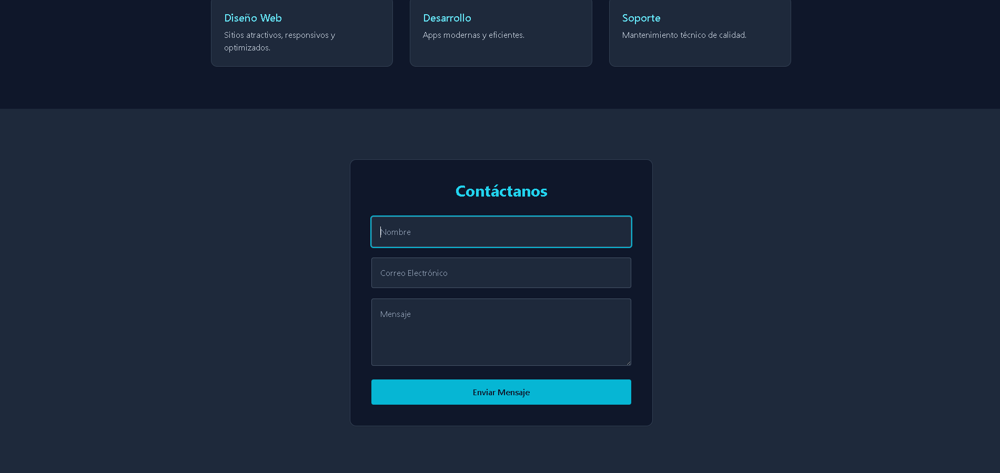
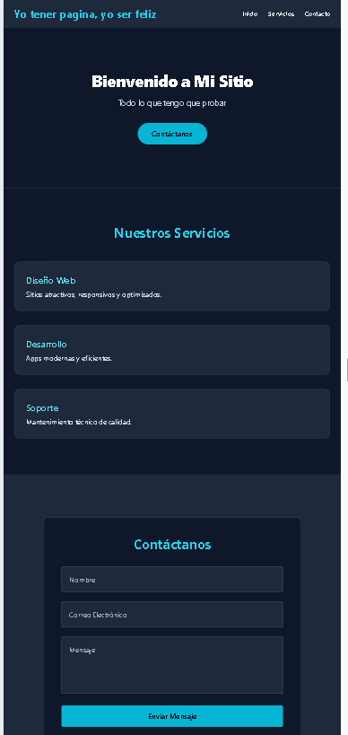

# Página Web Responsiva con Tailwind CSS

Lo cree para probar el tailwind y terminar esta tarea xd.

## Resumen basico de como cree el tailwind

primero que nada mi secuencia fue algo asi:
1. abrir cmd en VSC y dirigirme a mi archivo(cd ejemplo)
2. colocar ahi este codigo ```css npm install -D tailwindcss@3.3.5 ``` (porque en esa version? porque esa almenos fue en la que me funciono y no me dio errores) eso me creara package.jason package-lock.json ademas del node_modules
3. ahora para crear mi tailwind.config.js que es donde le diremos a tailwind donde aplicar los estilos, esto lo creamos con ```css npx tailwindcss init ```
4. crear un .html y un .css, el html a lo que me gusto con sus clases que seran el estilo que tendra, y el css simplemente con un:
   ```css
   @tailwind base;
   @tailwind components;
   @tailwind utilities;
   ```
  Porque el css asi? eso es para llamar e insertar los estilos de Tailwind, el base para los diseños basicos el otro de componentes sea contenedores botones.  Y el ultimo para utilidades sea los bg-slate-800 entre otros, esta ultima es importante
  ya que tailwind trabaja con full utilidades.
6. al momento ya de ejecucion se necesita crear el output.css que sera de donde se creara todo el css con responsivida y todo para nuestro html, lo creamos con "npx tailwindcss -i ./styles.css -o ./output.css --watch"

## Cuando lo importes dentro de tu VSC

Solamente necesitas dar un "npm install -D tailwindcss@3.3.5" para que descargue la carpeta node_modules que leera los otros paquetes del repositorio.

## Características

- Barra de navegación
- Sección héroe con mensaje de bienvenida y botón CTA
- Tarjetas de contenido para servicios
- Formulario de contacto
- Diseño completamente responsivo para móviles y escritorio

## Captura de pantalla




## Responsividad




