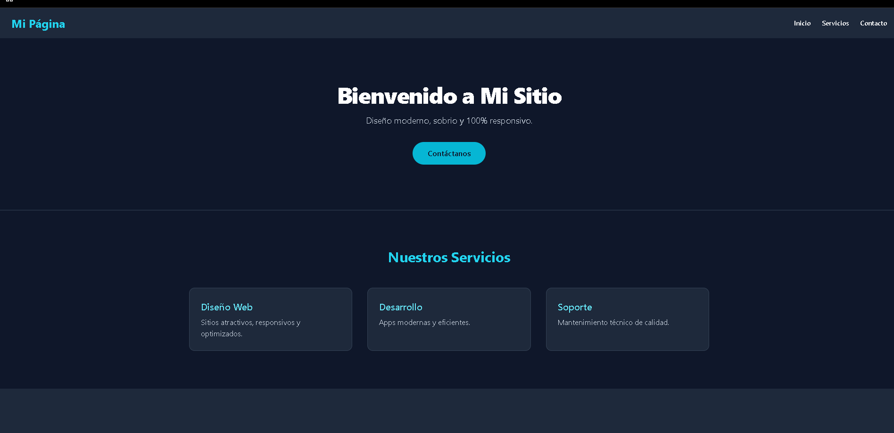

# Página Web Responsiva con Tailwind CSS

Lo cree para probar el tailwind y terminar esta tarea xd.

## Características

- Barra de navegación
- Sección héroe con mensaje de bienvenida y botón CTA
- Tarjetas de contenido para servicios
- Formulario de contacto
- Diseño completamente responsivo para móviles y escritorio

## Captura de pantalla

